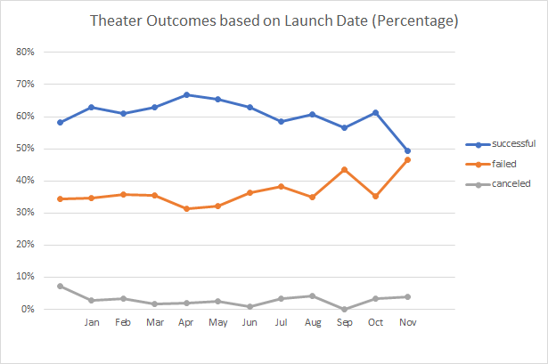
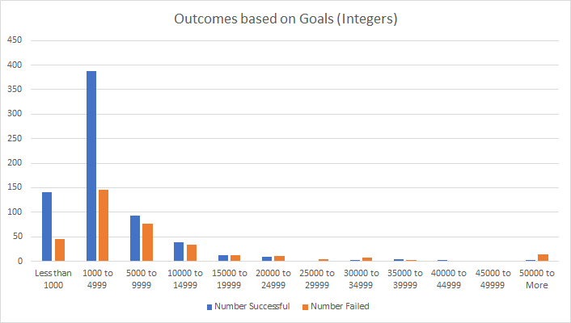

# An Analysis of Kickstarter Campaigns

## Overview of Project
### This project analyzes data from a variety Kickstarter Campaigns in order to reveal the characteristics of successful campaigns. Specifically, the analysis focuses on the characteristics of campaigns in the Theater category and the Play subcategory and seeks to determine the optimal financial goal and launch date to ensure that Louise develops a successful campaign to fund her new play.

## Analysis and Challenges

This analysis sought to uncover the outcomes of a set of Kickstarter campaigns based on the financial goal set by each campaign and the date that each campaign was launched. While the financial data provided was ready to manipulate, the information for the launch date of each campaign was originally provided as a Unix timestamp and needed to be converted to a readable human date. Additionally, information on the Category and Subcategory of each campaign was provided in a single column, making it challenging to filter each variable separately. Two separate columns were made for Category and Subcategory to alleviate this issue.

##### Analysis of Outcomes based on Launch Date

We looked at the distribution of campaign outcomes for theater Kickstarters based on the launch date of the campaign in order to see if there is a time of the year where campaigns are particularly successful. In order to do this we created a pivot chart that plots successful, failed, and canceled theater campaigns according to the month of the year that they were launched, as seen in the image above.

The results reveal that May-July saw the most successsful kickstarter campaigns, suggesting that this period may be a good time to launch a campaign. However, the number of failed kickstarter campaigns is also relatively high during this period, only to be outdone by November. This suggests that the period of May-July might simply be the time period when the most kickstarter campaigns are launched regardless of their outcomes. The challenge presented by this visualization is that it does not provide information on the percentage of total campaigns that were either successful or failed.

When we calculate the percentages of successful, failed, and canceled campaigns of the total campaigns launched each month and plot them as seen above, we see that the percentage of successsful campaigns remains steadily within the 57-67% throughout the entire year. The exception of note is December, when the number of successsful campaigns decreases to 49%. December may not be a good month to start a theater kickstarter campaign. 

##### Analysis of Outcomes based on Goals

We also looked at the distribution of campaign outcomes specifically for play kickstarter campaigns based on the fundraising goal of each campaign. We did this by filtering the kickstarter data set for successful, failed and canceled play campaigns sorted into fundraising goals of $5000 intervals as seen on the chart above.

The results suggest that the play kickstarter campaigns that saw the most success (between a 73-76% success rate) were campaigns with a goal of less than $5000. However, the chart above also suggests that campaigns with a goal of $35000-44999 also had a relatively high success rate (of 67%). The challenge that is presented by this visualization is that it does not provide information on how many campaigns were actually launched in each fundraising interval. So while 67% of campaigns with a fundraising goal of $35000-44999 were successful, this only represents 6 successful campaigns. It is unclear whether this success rate would be maintained given a larger sample size of campaigns with goals in this fundraising interval. 

The above bar graph displays the total number of successful and failed plays campaigns by goal interval. This visualization paints a clearer picture because it shows us the total number of successful campaigns per fundraising goal, revealing that there were substantially more successful campaigns in the $1000-4999 range than in the $35000-39999 range even though the percentage of total successful campaigns in each of these intervals is similar.

## Results

##### Results based on Launch Date

As mentioned in the analysis above, the initial chart plotting the outcomes of campaigns based on their launch date seemingly suggests that the most successful theater campaigns were launched in May-July while the least successful campaigns were launched in December. While it is true that May-July saw the launch of the largest number of successful campaigns, this period of time also saw the launch of the some of the highest numbers of failed campaigns. 

Thus, looking at the percentages of successful vs failed campaigns for each month provides a better picture of the liklihood for success of a campaign launched at any given time. The second chart reveals that theater campaigns actually had a steady 57-67% success rate throughout the year, with the highest percentage of successful campaigns (67%) being launched in April, rather than May-July. December saw the lowest success rate for theater campaigns, which in this case happens to match the impression provided by the first chart. 

##### Results Based on Goals

As mentioned in the analysis above, the initial line chart plotting the percentage of successful plays by fundraising goal seemed to suggest that the financial goals that saw the most success were in the ranges of $0 - 4999 and $35000-44999. However, this visualization did not account for the fact that there were actually only 9 campaigns that had goals in the range of $35000-44999, compared to the 720 campaigns in the range of $0 - 4999. The subsequent bar graph shows not only that the majority of plays kickstarter campaigns had goals in the range of $0 - 4999, but that this is also the range which saw the largest total of successful campaigns.

##### Limitations

One of the limitations of this dataset are the outlier campaigns that set much higher financial goals than the majority of the other campaigns. For instance, when looking at plays, the majority of campaigns set goals of under $10000. However, a handful of campaigns set goals above $10000 and an even smaller number of campaigns set goalsabove $50000. These data points have the potential to skew our analyses and even lead to some unreastic conclusions. As mentioned in the Outcomes based on Goals analysis, taking a look at the percentage of successful campaigns (67%) with goals set between $35000-44999 might lead us to believe such a fundrasing goal could be realistic and successful. However, the 9 campaigns with goals in this range represent outliers in the data set and it is unclear whether this success rate would remain the same if a larger number of campaigns with goals of $35000-44999 were surveyed.

##### Further Research 

I completed further research on the Launch Date Outcomes by creating a chart that plotted the percentages of successful, failed, and canceled campaigns by month. One could continue to explore the effects of a campaign's launch date by creating a chart that looks at success rates (again by percentage) of campaigns by year. Was there a particular year that saw more successful campaigns? 

I also completed some additional research on the Goals Outcomes by creating an additional bar graph plotting the total number of successful and failed plays per financial goal intervals. One could continue to explore the distribution of successful and failed play campaigns by financial goal by creating a box and whisker chart.
