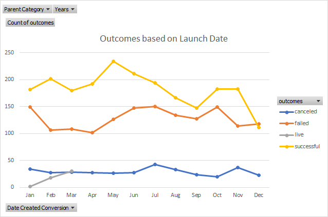

# An Analysis of Kickstarter Campaigns
This project analyzes data from Kickstarter Campaigns in order to reveal the characteristics of successful campaigns
---
* Theater projects are the most popular kickstarter campaigns in the US, and over 50% of these campaigns are successful
---

---
Theater Kickstarter campaigns can poise themselves for success by pursuing a realistic fundraising goal. Based on the Kickstarter Campaign data, the average amount of money pledged to a Kickstarter campaign for a play is about $5,600.  
